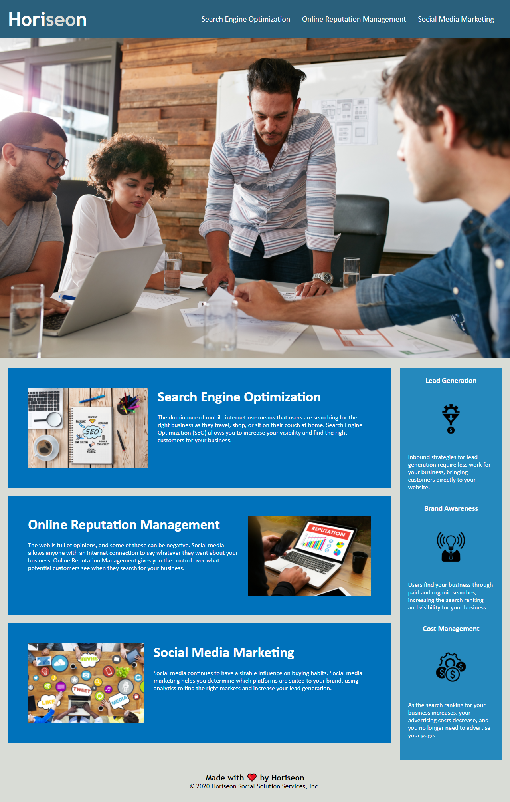

# **HORISEON**

## Description
The Online Idintity for Horiseon, build so that Horiseon provides Search Engine Optimization, Online Reputation Management, and Social Media Marketing as thier main services.

## Task
Refactor code by meeting standards in web accessibility and following the Scout Rule. Improve codebase for long term sustainability and ensure that all links are functioning correctly and clean up the CSS to make it more efficient.

## Ocuring Issues
*Optimizing the HTML and having the right tags.
*Optimizing the CSS and having the right set-up.

## Installation
*Internet Access
*Link to the Homepage.

Link: https://github.com/AmmarLegend/Horiseon

Best OF Luck!!!
